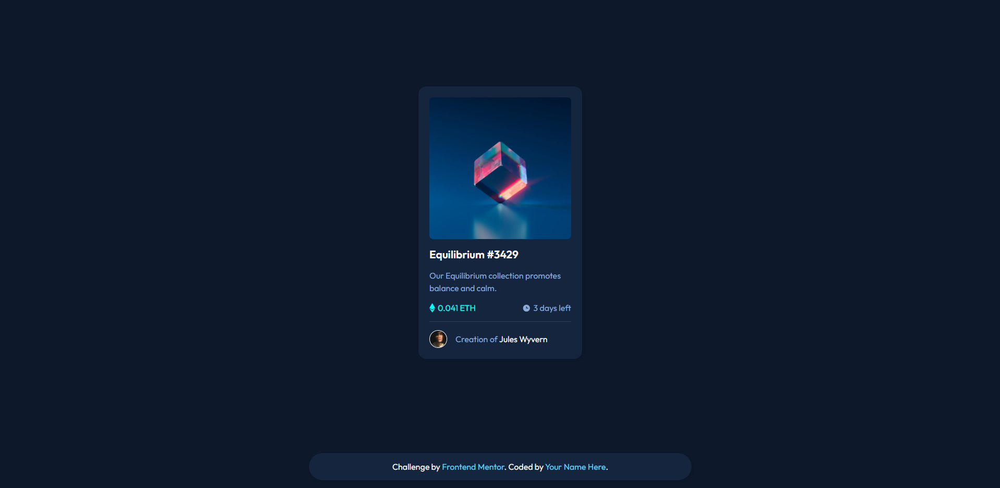
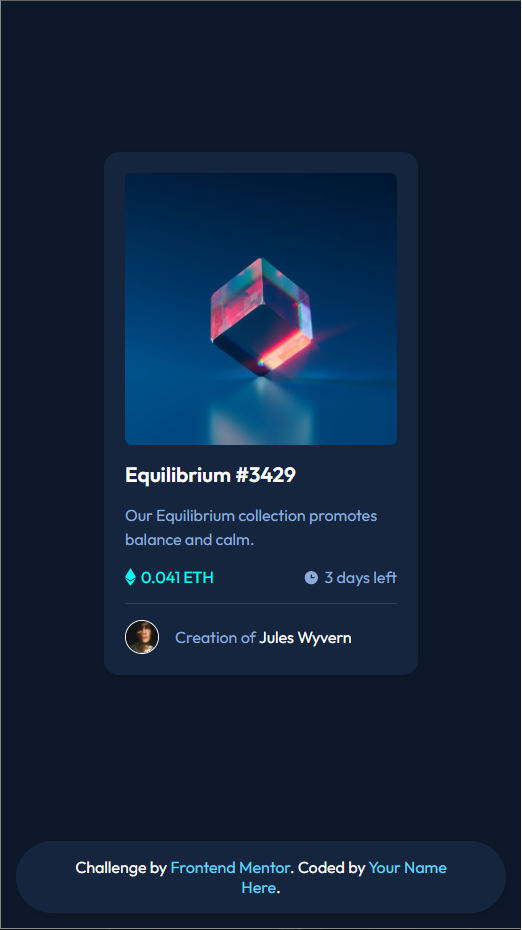

# Frontend Mentor - NFT preview card component solution

This is a solution to the [NFT preview card component challenge on Frontend Mentor](https://www.frontendmentor.io/challenges/nft-preview-card-component-SbdUL_w0U). Frontend Mentor challenges help you improve your coding skills by building realistic projects.

## Table of contents

- [Overview](#overview)
  - [The challenge](#the-challenge)
  - [Screenshot](#screenshot)
  - [Links](#links)
- [My process](#my-process)
  - [Built with](#built-with)
  - [What I learned](#what-i-learned)
  - [Continued development](#continued-development)
- [Author](#author)

## Overview

### The challenge

Users should be able to:

- View the optimal layout depending on their device's screen size
- See hover states for interactive elements

### Screenshot

##### Desktop

##### Mobile

### Links

- Live Site URL: [Here](https://igafshell.github.io/nft-preview-card-component-main/)

## My process

I started out with thinking about the html structure, then I created a git repo, fired up vs code and started coding. After finishing with the html I quickly styled the html with some css, applying the required font, colors and other details. Also, I used css variables for the first time to make my code better. After finishing the card I got to coding the hover effects, and here is where I encountered some difficulties. I had already known how to use pseudo-selectors, including `:hover`, but I had some trouble making the effect for the nft image. After a few hours of debuging and research, I managed to make it work.

Well, that was about it. It was harder then I expected but instead now I really know how to make hover effects.

### Built with

- Semantic HTML5 markup
- Vanilla CSS

### What I learned

I learned:

- How to make hover effects, not only on text, but on images too
- How to apply transparent background colors using `rgba()` colors
- How to use css variables

### Continued development

I will continue making projects on Frontend Mentor and learning how to code on the frontend.

## Author

Hi, I'm igafshell, just a dude trying to learn how to code

- Frontend Mentor - [@igafshell](https://www.frontendmentor.io/profile/igafshell)
- Github - [igafshell](https://github.com/igafshell)

## Acknowledgments

I want to thank [Frontend Mentor](https://www.frontendmentor.io/home) for providing this awesome challenge!
